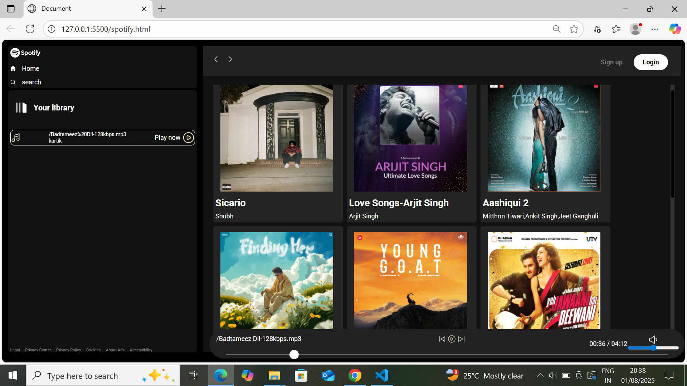

# spotify-html-css-js
🎵 A responsive Spotify clone built using HTML, CSS, and JavaScript — replicates core UI and music player functionality.
# 🎧 Spotify Clone

A responsive clone of the Spotify music player interface, built using **HTML**, **CSS**, and **JavaScript**. This project replicates the look and feel of Spotify's web player, including core UI elements and music player controls.

---

## 🚀 Features

- ✅ Responsive and modern Spotify-like UI
- ✅ Static playlist and song section
- ✅ Music player with play/pause button
- ✅ Smooth UI transitions and hover effects
- ✅ Built entirely with vanilla JS, HTML & CSS (no frameworks)

---

## 🛠️ Tech Stack

- **HTML5**
- **CSS3**
- **JavaScript (ES6)**

---

## 📸 Screenshots

| Desktop View | Mobile View |
|--------------|-------------|
|  |  |

---

## 🧑‍💻 How to Run Locally

1. Clone the repository:

```bash
git clone https://github.com/yourusername/spotify-clone.git
cd spotify-clone

